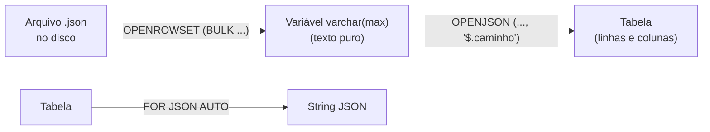

# Importando e Gerando JSON no SQL Server

[← Voltar a Engenharia de Dados](https://github.com/joycequoos/Data_Enginer/blob/main/README.md)

Explicação passo a passo do script [`01_Importar_Arquivo_JsonSQL.sql`](https://github.com/joycequoos/SQL/blob/main/SQL_Json/01_Importar_Arquivo_JsonSQL.sql), que mostra os dois sentidos da relação entre JSON e tabela no SQL Server: ler um arquivo `.json` do disco e transformá-lo em linhas de tabela, e o caminho inverso — transformar uma tabela em JSON.

## Índice

- [O arquivo JSON de exemplo](#o-arquivo-json-de-exemplo)
- [Parte 1 — Lendo o arquivo para uma variável](#parte-1--lendo-o-arquivo-para-uma-variável)
- [Parte 2 — Transformando o JSON em tabela](#parte-2--transformando-o-json-em-tabela)
- [Parte 3 — Transformando uma tabela em JSON](#parte-3--transformando-uma-tabela-em-json)
- [Resumo das funções usadas](#resumo-das-funções-usadas)
- [Próximos passos](#próximos-passos)

---

## O arquivo JSON de exemplo

O script parte de um arquivo `pessoas.json` salvo em `c:\tmp\`, com a seguinte estrutura:

```json
{
  "pessoas": {
    "pessoa": [
      { "id": "1", "nm": "Priscila Laborão",  "profissao": "Recrutadora" },
      { "id": "2", "nm": "Tiragato Dakatola",  "profissao": "Mágico" },
      { "id": "3", "nm": "Rick Win",           "profissao": "Usineiro" }
    ]
  }
}
```

Repare que o array de pessoas fica aninhado dentro de dois níveis: `pessoas` → `pessoa`. Esse caminho (`$.pessoas.pessoa`) é o que o script usa mais adiante para "achar" a lista dentro do JSON.

## Parte 1 — Lendo o arquivo para uma variável

```sql
declare @j varchar(max) = (
  select bulkcolumn
  from openrowset (bulk 'c:\tmp\pessoas.json', single_clob) a
)
select @j as [json]
```

| Elemento | O que faz |
| --- | --- |
| `OPENROWSET (BULK ..., SINGLE_CLOB)` | Lê o conteúdo inteiro de um arquivo do disco como um único bloco de texto (`CLOB` — Character Large Object) |
| `bulkcolumn` | Nome da coluna que o `OPENROWSET` usa para devolver esse conteúdo |
| `@j varchar(max)` | Variável que recebe o JSON inteiro como uma string |

Nesse ponto, `@j` contém o arquivo `pessoas.json` inteiro como texto puro — o SQL Server ainda não entende que aquilo é um JSON estruturado, é só uma string grande.

## Parte 2 — Transformando o JSON em tabela

```sql
select *
from openjson (@j, '$.pessoas.pessoa')
with (id int, nm varchar(100), profissao varchar(100)) pessoas
```

| Elemento | O que faz |
| --- | --- |
| `OPENJSON(@j, '$.pessoas.pessoa')` | Interpreta a string JSON e navega até o caminho `$.pessoas.pessoa`, onde está o array de pessoas |
| `WITH (id int, nm varchar(100), profissao varchar(100))` | Define o "esquema" de saída: cada chave do objeto JSON (`id`, `nm`, `profissao`) vira uma coluna, já com o tipo de dado correto |

O resultado é uma tabela normal, com 3 linhas e 3 colunas — exatamente como se os dados tivessem vindo de um `SELECT` numa tabela relacional:

| id | nm | profissao |
| --- | --- | --- |
| 1 | Priscila Laborão | Recrutadora |
| 2 | Tiragato Dakatola | Mágico |
| 3 | Rick Win | Usineiro |

A partir daqui, essa consulta poderia virar um `INSERT INTO` para carregar esses dados numa tabela definitiva do banco.

## Parte 3 — Transformando uma tabela em JSON

O script também mostra o caminho inverso, usando uma tabela de exemplo em memória:

```sql
declare @pessoas table (id int, nm varchar(100), profissao varchar(100))
insert into @pessoas values
    (1, 'Priscila Laborão', 'Recrutadora'),
    (2, 'Tiragato Dakatola', 'Analista de TI'),
    (3, 'Ric Wyndfuck', 'Usineiro')

select *
from @pessoas as pessoa
for json auto, root('pessoas')
```

| Elemento | O que faz |
| --- | --- |
| `declare @pessoas table (...)` | Cria uma variável do tipo tabela, só para fins do exemplo |
| `FOR JSON AUTO` | Transforma o resultado do `SELECT` em uma string JSON, gerando automaticamente a estrutura a partir dos nomes das colunas |
| `ROOT('pessoas')` | Envolve o JSON gerado num objeto raiz chamado `"pessoas"`, em vez de devolver só um array solto |

O resultado é um JSON parecido com este:

```json
{
  "pessoas": [
    { "id": 1, "nm": "Priscila Laborão", "profissao": "Recrutadora" },
    { "id": 2, "nm": "Tiragato Dakatola", "profissao": "Analista de TI" },
    { "id": 3, "nm": "Ric Wyndfuck", "profissao": "Usineiro" }
  ]
}
```

> Repare que essa segunda tabela tem valores ligeiramente diferentes do arquivo original (ex.: "Analista de TI" em vez de "Mágico") — é só uma tabela de exemplo independente, usada apenas para demonstrar o `FOR JSON`, não os mesmos dados lidos do arquivo.

## Resumo das funções usadas



| Função | Direção | Uso típico |
| --- | --- | --- |
| `OPENROWSET (BULK ..., SINGLE_CLOB)` | Arquivo → Texto | Ler o conteúdo de um arquivo do disco (JSON, texto, etc.) para dentro do SQL Server |
| `OPENJSON()` | Texto JSON → Tabela | Importar/carregar dados de um JSON para uma tabela relacional |
| `FOR JSON AUTO` | Tabela → Texto JSON | Exportar o resultado de uma consulta como JSON, para consumo por uma API ou outro sistema |

## Próximos passos

- Adicionar tratamento de erro (`TRY/CATCH`) para o caso do arquivo não existir ou o JSON estar malformado.
- Usar `OPENJSON` sem o `WITH` explícito para explorar dinamicamente a estrutura de um JSON desconhecido (retorna `key`, `value`, `type`).
- Testar `FOR JSON PATH` como alternativa ao `FOR JSON AUTO`, para ter controle total sobre os nomes e o aninhamento das chaves geradas.
- Encadear a Parte 2 com um `INSERT INTO tabela_definitiva SELECT ...` para completar o fluxo de carga real, em vez de apenas exibir o resultado com `SELECT *`.
